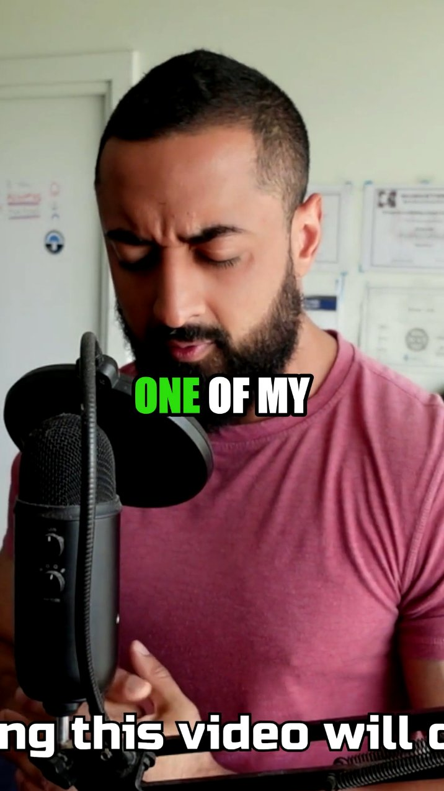
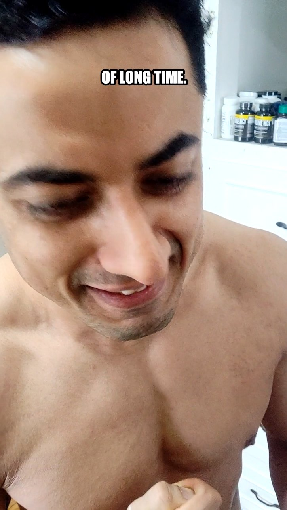

# watch-video skill

A Claude skill that lets Claude "watch" videos by extracting a time-synced transcript plus still frames, then reading them together to produce structured notes.

Works with any Claude surface that supports the skill format — **Claude Code**, **Claude Desktop**, and apps built on the **Claude Agent SDK**.

## Watch the tutorial

<p align="center">
  <a href="https://www.youtube.com/watch?v=U10NUi4FqnU">
    
  </a>
</p>

## What it does

Claude models can see images but can't stream video. This skill fakes video comprehension:

1. Pulls a transcript — YouTube captions first, [Whisper](https://github.com/openai/whisper) as a local fallback.
2. Extracts still frames at a configurable interval via ffmpeg.
3. Aligns each frame with the sentence being spoken at that timestamp.
4. Claude reads frames + transcript and writes a markdown notes file (one-line summary, TL;DR, timestamped timeline, key quotes, visual notes).

Works with YouTube URLs and local video files.

## Use cases

**1.** If you don't understand anything, you can make Claude watch a video and then plan from there on out; Claude Code will have a much clearer understanding. I saw a custom extension being built for downloading courses and started vibe-coding Claude on that, and it's doing a really, REALLY good job! ;)


**2.** Someone was giving me screenshots and walking me through a video on how to do a funnel better. In trying to make Claude learn it, it was much easier for it to just watch the whole video, including the screenshots of the conversations that were being had. This gave it a real, live example of how DM conversations go.


**3.** I'm creating my own Opus Clip Claude Code skill. The difference between the first example that Claude Code made versus the final example it produced is significant, because I was able to show it a demo of what my perfect reel actually looks like.

<p align="center">
  
  &nbsp;&nbsp;
  
</p>

**4.** If you like a certain YouTuber's style of editing videos, you can make Claude Code watch two or three of their videos to understand their editing style!

Now, with the new video editing tools like Remotion and Hyperframes, you can actually edit your entire videos through Claude Code in exactly that manner. Since it can see what is on screen and understand how it works along with the timestamps, it can replicate that specific style for you.

## Install

Clone into your Claude skills folder:

```bash
# macOS / Linux
git clone https://github.com/Newuxtreme/watch-video-skill.git ~/.claude/skills/watch-video

# Windows
git clone https://github.com/Newuxtreme/watch-video-skill.git %USERPROFILE%\.claude\skills\watch-video
```

For Claude Desktop or Claude Agent SDK apps, clone into whatever folder that environment loads skills from.

### Dependencies

- **ffmpeg** — [download](https://ffmpeg.org/download.html) or `brew install ffmpeg` / `choco install ffmpeg`
- **yt-dlp** — `python -m pip install --user yt-dlp`
- **openai-whisper** (optional, only needed for videos without captions) — `python -m pip install --user openai-whisper`

## Usage

Once installed, just ask Claude to watch a video:

```
Watch this: https://www.youtube.com/watch?v=...
Take notes on this reel: https://...
Summarize this video: /path/to/local/video.mp4
```

Claude invokes the skill automatically when the request matches.

## Direct CLI usage

The extractor can run standalone:

```bash
python scripts/extract_video.py "<url-or-path>" --output-dir ./out --interval 1.0
```

Flags:
- `--interval N` — seconds between frames (default 1.0)
- `--whisper-model MODEL` — `tiny` / `base` / `small` / `medium` / `large` (default `base`)
- `--no-whisper` — skip transcription fallback

Outputs a `manifest.json` with frame paths, timestamps, and aligned transcript segments.

## Troubleshooting

**Windows + broken Python pip:** On some Windows setups, Python 3.12 and 3.13 ship with pip installs that fail on yt-dlp / whisper. If your default Python chokes, install Python 3.9 via [python.org](https://www.python.org/downloads/) and invoke explicitly: `py -3.9 -m pip install --user yt-dlp`.

**yt-dlp fails on YouTube Shorts / age-gated content:** The script uses the `android` player client as a fallback, which works for most cases. Members-only and region-locked content may still fail — yt-dlp will surface a clear error.

**"No module named whisper":** Either install whisper (`python -m pip install --user openai-whisper`) or pass `--no-whisper` to get frames-only output.

## License

MIT — see [LICENSE](LICENSE).
